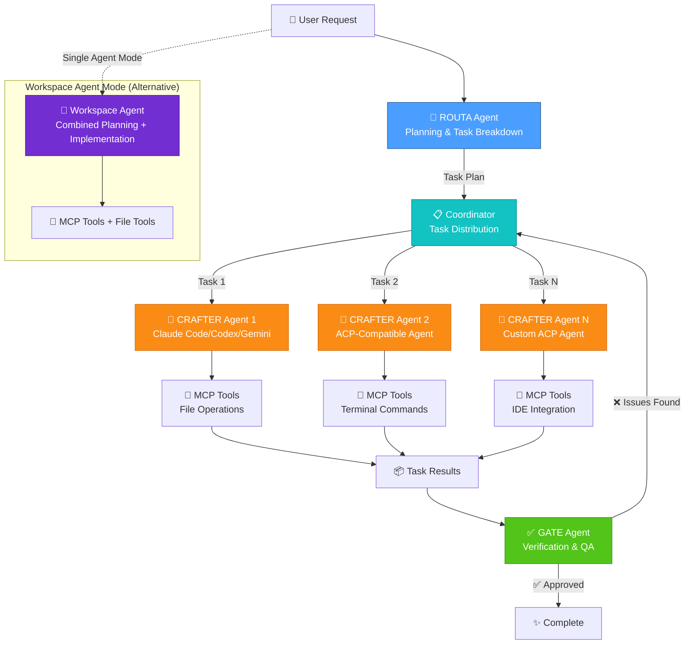
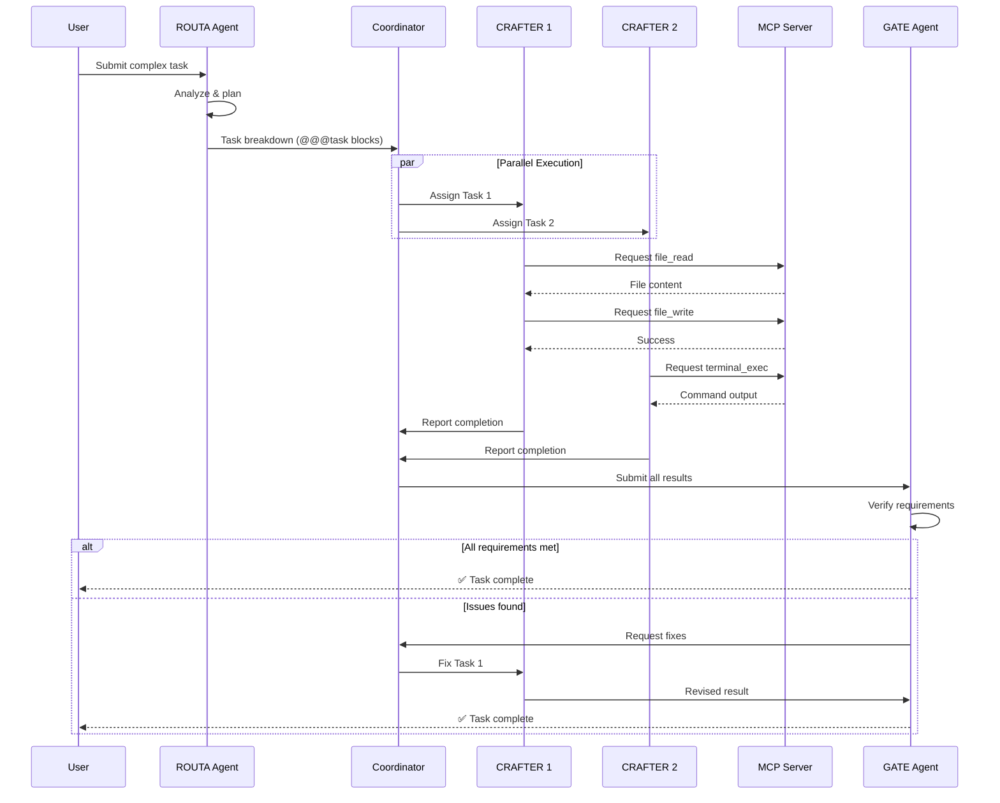
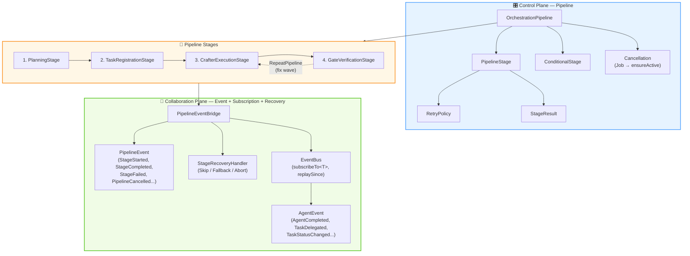
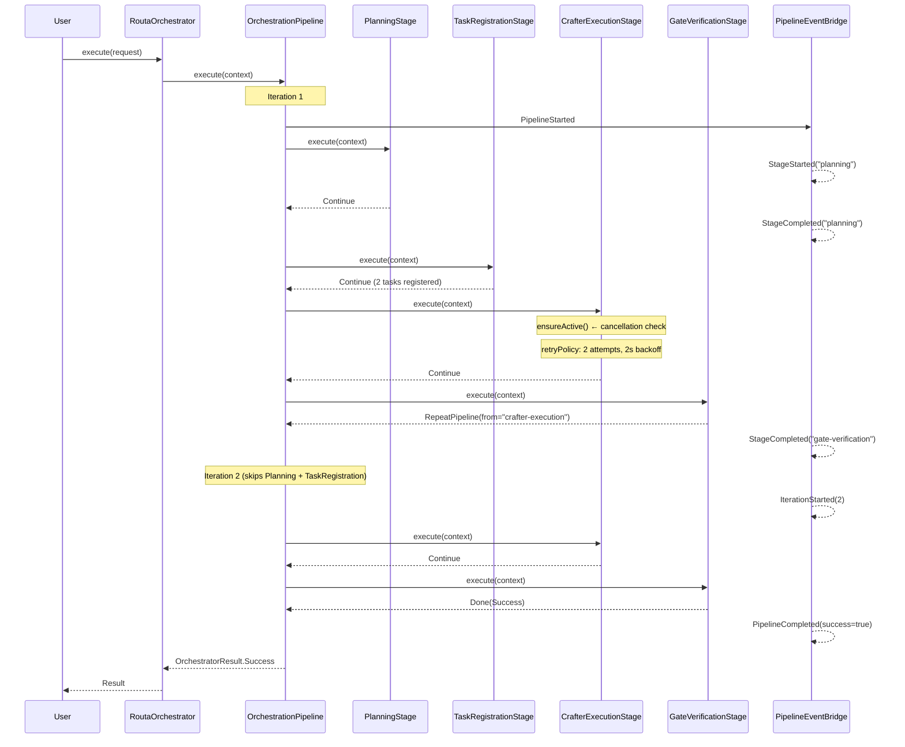

# Routa

<!-- Plugin description -->
Routa is a multi-agent orchestration system for IntelliJ IDEA that intelligently coordinates multiple AI agents to handle complex development tasks. It provides real-time streaming chat interface, tool call visualization, and efficient process lifecycle management.

**Multi-Agent Architecture:**
- **ROUTA Agent** - Master planner that analyzes user requests and breaks them into structured tasks
- **CRAFTER Agents** - Implementation specialists (Claude Code, Codex CLI, Gemini CLI, and any ACP-compatible agents) that execute tasks concurrently
- **GATE Agent** - Quality verifier that validates all work and ensures requirements are met
- **Workspace Agent** - Unified single-agent mode combining planning and implementation

Supports seamless integration with AutoDev/Xiuper configurations and MCP (Model Context Protocol) servers for enhanced tool capabilities.
<!-- Plugin description end -->

## Multi-Agent Orchestration

Routa implements an intelligent multi-agent pipeline that breaks down complex tasks and coordinates specialized agents:



### Agent Communication Flow



## Features

- 🎯 **Intelligent Planning** - ROUTA agent breaks down complex tasks into structured subtasks
- 🔨 **Specialized Execution** - Multiple CRAFTER agents work concurrently on different tasks
- ✅ **Quality Verification** - GATE agent validates all work and ensures requirements are met
- 🏢 **Workspace Mode** - Single unified agent for simpler tasks combining planning and execution
- 🔌 **MCP Integration** - Model Context Protocol support for file operations, terminal commands, and IDE tools
- 🔄 **Multi-agent session management** - Run multiple agents simultaneously with health monitoring
- 💬 **Real-time streaming chat** - See agent responses as they stream in
- 🛠️ **Tool call visualization** - Monitor MCP tool executions with clear status indicators
- 📊 **Beautiful UI** - Clean chat interface with role-specific message styling
- 🎯 **Auto-Detection** - Automatically discovers agents from `~/.autodev/config.yaml` (AutoDev/Xiuper integration)
- ⚙️ **YAML-based configuration** - Easy agent setup and management

## Supported Agents

Any ACP-compatible agent, including:
- **Claude Code** (Anthropic)
- **Codex CLI** (OpenAI)
- **Gemini CLI** (Google)
- And any custom ACP agents

## Quick Start

### 1. Installation

**Install the plugin** in IntelliJ IDEA 2025.2+:
- Download from JetBrains Marketplace (coming soon) or build from source
- Install via Settings → Plugins → Install from Disk

### 2. Configure Your Agents

**Option A: Automatic Detection (Easiest)**

If you have AutoDev/Xiuper installed, Routa will automatically use your existing agents from `~/.autodev/config.yaml`.

**Option B: Manual Configuration**

Create `~/.agent-dispatcher/config.yaml`:

```yaml
# Active agent (optional - can be set via UI)
activeAgent: codex

# Available agents
agents:
  codex:
    command: codex
    args: ["--full-auto"]
    description: "OpenAI Codex CLI"
    autoApprove: false
    env:
      OPENAI_API_KEY: "your-api-key-here"
  
  claude:
    command: claude
    args: []
    description: "Anthropic Claude Code"
    autoApprove: true
```

### 3. Start Using Routa

1. **Open Routa** tool window (View → Tool Windows → Routa)
2. **Select an agent** from the dropdown (e.g., "codex", "claude")
3. **Choose mode**:
   - **Multi-Agent Mode**: Complex tasks requiring specialized agents (ROUTA → CRAFTERs → GATE)
   - **Workspace Mode**: Simpler tasks with a single unified agent
4. **Start chatting**! Type your request and press Enter

### Example Workflow

**Multi-Agent Mode:**
```
👤 User: "Add user authentication to the REST API with JWT tokens, 
         write tests, and update the API documentation"

🎯 ROUTA: Breaks down into tasks:
  - Task 1: Implement JWT authentication middleware
  - Task 2: Add user login/register endpoints
  - Task 3: Write unit tests for auth flows
  - Task 4: Update OpenAPI/Swagger docs

🔨 CRAFTERs: Execute tasks in parallel
  - CRAFTER 1: Implements authentication (uses file_write, terminal_exec)
  - CRAFTER 2: Writes tests (uses file_read, file_write)
  
✅ GATE: Verifies all requirements met, tests pass, docs updated
```

**Workspace Mode:**
```
👤 User: "Fix the bug in user-service.ts where undefined user causes crash"

🏢 Workspace Agent: Analyzes → Fixes → Tests → Reports completion
```

## Configuration

Routa uses a smart 3-tier configuration system with automatic agent detection:

### Configuration Priority

```
Highest: ~/.agent-dispatcher/config.yaml (your manual configurations)
   ↓
Middle:  ~/.autodev/config.yaml (AutoDev/Xiuper shared config)
   ↓
Lowest:  System PATH (auto-detected CLI tools - only for missing agents)
```

### 1. Automatic Detection from AutoDev/Xiuper

If you already use [AutoDev](https://github.com/unit-mesh/auto-dev) or [Xiuper](https://github.com/unit-mesh/xiuper), Routa will **automatically use** your existing agent configurations from `~/.autodev/config.yaml`:

```yaml
# ~/.autodev/config.yaml (your existing config)
acpAgents:
  opencode:
    name: "OpenCode"
    command: "/Users/phodal/.opencode/bin/opencode"
    args: "acp"
    env: ""
  kimi:
    name: "Kimi"
    command: "/Library/Frameworks/Python.framework/Versions/3.12/bin/kimi"
    args: "acp"
    env: ""
  claude:
    name: "Claude Code"  
    command: "/opt/homebrew/bin/claude"
    args: ""
    env: ""
activeAcpAgent: kimi
```

**These agents will be used as-is, with their full configured paths.**

### 2. Auto-Detection for Missing Agents

For agents **NOT** in your AutoDev config, Routa will automatically detect them from your system PATH:

- Checks common ACP CLI tools: `codex`, `gemini`, `copilot`, `auggie`, etc.
- Uses `which` (Unix/macOS) or `where` (Windows) to find full paths
- Only adds agents that are missing from your existing config

### 3. Manual Configuration

Create or edit `~/.agent-dispatcher/config.yaml` to add custom agents or override any settings:

```yaml
# Active agent (optional - can be set via UI)
activeAgent: codex

# Available agents
agents:
  codex:
    command: codex
    args: ["--full-auto"]
    description: "OpenAI Codex CLI"
    autoApprove: false  # Auto-approve permission requests
    env:
      OPENAI_API_KEY: "your-api-key-here"
  
  claude:
    command: claude
    args: []
    description: "Anthropic Claude Code"
    autoApprove: true
  
  gemini:
    command: gemini
    args: ["--mode", "code"]
    description: "Google Gemini CLI"
    env:
      GOOGLE_API_KEY: "your-api-key-here"
```

**Note:**
- Agents in `~/.agent-dispatcher/config.yaml` override AutoDev config
- Agents in `~/.autodev/config.yaml` are used as configured (with full paths)
- Auto-detection only fills in **missing** agents from system PATH

### Configuration Options

- **command**: The executable command for the agent
- **args**: Command-line arguments (optional)
- **description**: Human-readable description shown in UI
- **autoApprove**: Automatically approve permission requests (default: false)
- **env**: Environment variables for the agent process

## Usage

### Multi-Agent Mode

1. Open the **Routa** tool window (View → Tool Windows → Routa)
2. Select **Multi-Agent Mode** from the mode selector
3. Configure agents:
   - **ROUTA Agent**: Master planner (default: same as CRAFTER)
   - **CRAFTER Agent**: Implementation specialist (e.g., "claude", "codex")
   - **GATE Agent**: Quality verifier (default: same as CRAFTER)
4. Click **Connect** to initialize the multi-agent pipeline
5. Enter your complex task in the input area
6. Watch as ROUTA plans, CRAFTERs execute, and GATE verifies!

**Example Tasks:**
- "Implement a user authentication system with JWT, write comprehensive tests, and update the API documentation"
- "Refactor the payment processing module to use the new payment gateway API, migrate existing code, and add error handling"
- "Add a new feature to export reports as PDF, including charts, with proper styling and pagination"

### Workspace Mode

1. Open the **Routa** tool window
2. Select **Workspace Mode** from the mode selector
3. Select your LLM model configuration (or use default from `~/.autodev/config.yaml`)
4. Click **Connect**
5. Enter your task and get immediate results

**Example Tasks:**
- "Fix the null pointer exception in UserService.java line 45"
- "Add input validation to the login form"
- "Optimize the database query in the getUsers method"

### Message Types

The chat interface shows different message types with distinct styling:

- 💬 **User** - Your messages (blue)
- 🤖 **Assistant** - Agent responses (gray)
- 🎯 **ROUTA** - Planning agent messages (blue)
- 🔨 **CRAFTER** - Implementation agent messages (orange)
- ✅ **GATE** - Verification agent messages (green)
- 🏢 **Workspace** - Workspace agent messages (purple)
- ⚡ **Tool Call** - Agent executing tools (orange)
- ✅ **Tool Result** - Tool execution results (green/red)
- 💭 **Thinking** - Agent's internal reasoning (purple)
- ℹ️ **Info** - System messages (cyan)
- ⚠️ **Error** - Error messages (red)

## Architecture

### Two-Plane Architecture

Routa's `routa-core` orchestration engine is built on a **two-plane architecture** that cleanly separates execution control from observability and recovery:



#### Control Plane (Pipeline)

The control plane owns **stage execution order, retry, cancellation, and iteration control**:

| Component | Description |
|-----------|-------------|
| `OrchestrationPipeline` | Executes stages in sequence, handles RepeatPipeline (fix waves skip Planning/TaskRegistration) |
| `PipelineStage` | Interface for composable stages with optional `retryPolicy` |
| `RetryPolicy` | Per-stage retry with exponential backoff (e.g., CrafterExecution retries 2× on network errors) |
| `ConditionalStage` | Decorator that skips a stage at runtime based on a `condition(context)` predicate |
| `PipelineContext` | Shared state + `ensureActive()` for cooperative cancellation via coroutine Job |
| `StageResult` | Sealed class: `Continue`, `SkipRemaining`, `RepeatPipeline(fromStage)`, `Done`, `Failed` |

#### Collaboration Plane (Event + Subscription + Recovery)

The collaboration plane provides **observability, error recovery, and cross-cutting concerns**:

| Component | Description |
|-----------|-------------|
| `PipelineEventBridge` | Emits `PipelineEvent`s (StageStarted/Completed/Failed/Skipped, PipelineCancelled) with typed subscription API |
| `StageRecoveryHandler` | Maps exceptions to recovery actions after retries: `Skip` (continue), `Fallback` (substitute result), `Abort` (fail) |
| `EventBus` | System-wide agent events with `subscribeTo<T>()`, `subscribeWhere {}`, replay, and bounded critical event log |
| `AgentEvent` | Agent lifecycle events (AgentCompleted, TaskDelegated, TaskStatusChanged) for coordination |

#### Pipeline Execution Flow



### Core Components

#### Multi-Agent Pipeline

- **RoutaOrchestrator** - Thin facade: creates `PipelineContext` and delegates to `OrchestrationPipeline`
- **OrchestrationPipeline** - Control plane executor with retry, cancellation, recovery, and event emission
- **RoutaCoordinator** - Manages task distribution, agent status, and inter-agent communication
- **AgentProvider** - Abstract interface for running agents with health checks and streaming
- **CapabilityBasedRouter** - Dynamically routes tasks to the most suitable agent based on capabilities

#### Agent Providers

- **IdeaAcpAgentProvider** - IntelliJ-specific provider for ACP agents (CRAFTER role)
- **KoogAgentProvider** - LLM-based provider using JetBrains Koog AIAgent (ROUTA/GATE roles)
- **WorkspaceAgentProvider** - Unified single-agent provider (Workspace mode)
- **ResilientAgentProvider** - Decorator adding circuit breaker and session recovery

#### ACP Protocol Layer

- **AcpClient** - JSON-RPC over stdio transport
- **AcpProcessManager** - Process lifecycle and reuse
- **AcpSessionManager** - Multi-session management with observable state
- **AcpConfigService** - YAML configuration management

#### MCP Integration

- **McpService** - Manages MCP server lifecycle (IDE as MCP server)
- **McpToolManager** - Registers IDE tools (openFile, reformat, diff, diagnostics)
- **McpClientConnector** - Connects to external MCP servers (filesystem, memory, etc.)
- **RoutaMcpWebSocketServer** - WebSocket server exposing coordination tools to agents

### Execution Modes

**1. Multi-Agent Mode (Default)**
```
User Request → ROUTA (planning) → Coordinator → CRAFTERs (parallel) → GATE (verification)
```
- Best for: Complex tasks, code generation with tests, multi-file changes
- Agents: 1 ROUTA + N CRAFTERs + 1 GATE
- Parallelism: CRAFTERs can execute concurrently

**2. Workspace Mode**
```
User Request → Workspace Agent (planning + implementation)
```
- Best for: Simple tasks, quick fixes, single-file changes
- Agents: 1 Workspace Agent
- Tools: File operations + coordination tools combined

### Protocol Support

Full ACP 1.0 protocol implementation:
- ✅ Session initialization and management
- ✅ Prompt streaming with real-time updates
- ✅ Tool call execution (file I/O, terminal commands)
- ✅ Permission request handling
- ✅ Multi-turn conversations
- ✅ Session mode switching
- ✅ MCP server integration

MCP (Model Context Protocol) support:
- ✅ WebSocket server mode (IDE as MCP server)
- ✅ Client mode (connect to external MCP servers)
- ✅ Tool calling (file_read, file_write, terminal_exec, etc.)
- ✅ Agent coordination tools (report_to_parent, subscribe_to_events)
- ✅ Real-time notifications and event streaming

## Development

### Prerequisites

- JDK 21 or higher
- IntelliJ IDEA 2025.2+ (for running the plugin)
- Gradle 8.x (included via wrapper)

### Building from Source

```bash
# Clone the repository
git clone https://github.com/phodal/routa.git
cd routa

# Build the plugin
./gradlew buildPlugin

# The plugin will be built to build/distributions/routa-*.zip
```

### Running in Development

```bash
# Launch IntelliJ IDEA with the plugin loaded
./gradlew runIde

# Run with specific IntelliJ version
./gradlew runIde -PplatformVersion=2025.2
```

### Testing

```bash
# Run all tests
./gradlew test

# Run specific test suite
./gradlew test --tests "com.github.phodal.acpmanager.dispatcher.*"

# Run routa-core tests
./gradlew :routa-core:test

# Run with coverage
./gradlew koverHtmlReport
# Open build/reports/kover/html/index.html
```

### Project Structure

```
routa/
├── src/main/kotlin/com/github/phodal/acpmanager/
│   ├── acp/                    # ACP protocol implementation
│   │   ├── AcpClient.kt
│   │   ├── AcpProcessManager.kt
│   │   ├── AcpSessionManager.kt
│   │   └── AcpClientSessionOps.kt
│   ├── config/                 # Configuration management
│   │   ├── AcpConfigService.kt
│   │   └── AcpAgentConfig.kt
│   ├── dispatcher/             # Multi-agent orchestration
│   │   ├── AgentDispatcherInterfaces.kt
│   │   ├── DefaultAgentDispatcher.kt
│   │   └── routa/
│   │       ├── IdeaRoutaService.kt      # IntelliJ integration
│   │       └── IdeaAcpAgentProvider.kt  # ACP provider
│   ├── mcp/                    # MCP protocol integration
│   │   ├── McpService.kt
│   │   ├── McpToolManager.kt
│   │   └── McpClientConnector.kt
│   ├── claudecode/             # Claude Code renderer
│   │   ├── ClaudeCodeClient.kt
│   │   └── CrafterRenderer.kt
│   └── ui/                     # User interface components
│       ├── AcpToolWindowFactory.kt
│       ├── ChatPanel.kt
│       └── dispatcher/
│           └── DispatcherPanel.kt
├── routa-core/                 # Platform-agnostic orchestration core
│   └── src/main/kotlin/com/phodal/routa/core/
│       ├── pipeline/           # 🎛️ Control Plane
│       │   ├── OrchestrationPipeline.kt   # Stage executor with retry/cancel/recovery
│       │   ├── PipelineStage.kt           # Composable stage interface
│       │   ├── PipelineContext.kt          # Shared state + cancellation (Job)
│       │   ├── StageResult.kt             # Continue/Done/RepeatPipeline/Failed
│       │   ├── RetryPolicy.kt             # Per-stage retry with backoff
│       │   ├── ConditionalStage.kt        # Runtime stage skip decorator
│       │   ├── PipelineEvent.kt           # 📡 Lifecycle events
│       │   ├── PipelineEventBridge.kt     # Event emission + typed subscriptions
│       │   ├── StageRecoveryHandler.kt    # Post-retry recovery strategies
│       │   └── stages/
│       │       ├── PlanningStage.kt       # Stage 1: ROUTA plans tasks
│       │       ├── TaskRegistrationStage.kt # Stage 2: Parse @@@task blocks
│       │       ├── CrafterExecutionStage.kt # Stage 3: Run CRAFTERs
│       │       └── GateVerificationStage.kt # Stage 4: GATE verifies
│       ├── runner/             # Orchestration entry point
│       │   └── RoutaOrchestrator.kt       # Thin facade → Pipeline
│       ├── provider/           # Agent providers
│       │   ├── AgentProvider.kt
│       │   ├── AcpAgentProvider.kt
│       │   ├── KoogAgentProvider.kt
│       │   ├── ResilientAgentProvider.kt
│       │   └── WorkspaceAgentProvider.kt
│       ├── event/              # 📡 Collaboration Plane
│       │   ├── EventBus.kt               # subscribeTo<T>, replay, bounded log
│       │   └── AgentEvent.kt             # Agent lifecycle events
│       ├── report/             # LLM output parsing
│       │   ├── ReportParser.kt
│       │   └── TextPatternReportParser.kt
│       ├── coordinator/        # Task coordination
│       │   └── RoutaCoordinator.kt
│       ├── mcp/               # MCP server implementation
│       └── tool/              # Tool definitions
└── src/main/resources/META-INF/
    └── plugin.xml
```

### Key Technologies

- **Kotlin** - Primary language
- **IntelliJ Platform SDK** - Plugin framework
- **Kotlinx Coroutines** - Asynchronous programming
- **Kotlinx Serialization** - JSON handling
- **ACP SDK** - Agent Client Protocol
- **MCP SDK** - Model Context Protocol
- **Ktor** - WebSocket server for MCP

### MCP Development

To test MCP integration:

```bash
# Start the MCP server from IDE
# Then connect with MCP Inspector
npx -y @modelcontextprotocol/inspector --connect ws://localhost:3000/mcp

# Or test with external MCP servers
# Create mcp-config.json in project root
```

Example MCP configuration:
```json
{
  "mcpServers": {
    "memory": {
      "command": "npx",
      "args": ["-y", "@modelcontextprotocol/server-memory"]
    },
    "filesystem": {
      "command": "npx",
      "args": ["-y", "@modelcontextprotocol/server-filesystem", "/path/to/workspace"]
    }
  }
}
```

### Code Style

This project follows the standard Kotlin coding conventions:
- Use 4 spaces for indentation
- Maximum line length: 120 characters
- Follow IntelliJ IDEA's default formatting

Format code before committing:
```bash
./gradlew ktlintFormat
```

### Debugging

**Debug the Plugin:**
1. Run `./gradlew runIde` with debug flag
2. Attach debugger to port 5005
3. Set breakpoints in your IDE

**Debug Agent Communication:**
- Check logs in `~/.agent-dispatcher/logs/`
- Enable verbose logging in `plugin.xml`:
  ```xml
  <extensions>
    <applicationService serviceInterface="com.intellij.openapi.diagnostic.Logger"
                        level="DEBUG"/>
  </extensions>
  ```

**Debug MCP Tools:**
- Use MCP Inspector to test tool calls
- Check MCP server logs in IDE console
- Monitor WebSocket traffic in browser DevTools

## Troubleshooting

### Agent Won't Connect

1. **Check agent availability**:
   ```bash
   which claude  # or codex, gemini, etc.
   claude --version
   ```
2. **Verify configuration** in `~/.agent-dispatcher/config.yaml` or `~/.autodev/config.yaml`
3. **Check environment variables** (API keys, etc.)
4. **Review logs** in `~/.agent-dispatcher/logs/` for detailed error messages
5. **Try manual execution** to test the agent command directly

### Multi-Agent Mode Issues

- **ROUTA not generating plan**: Ensure ROUTA agent is configured and healthy
- **CRAFTERs stuck**: Check if MCP server is running (required for coordination)
- **GATE always rejects**: Review GATE agent configuration, may need different model
- **Tasks fail immediately**: Check agent capabilities match the task requirements

### MCP Server Issues

- **MCP server not starting**: Only Claude Code automatically starts MCP server
- **Tool calls failing**: Verify MCP server is configured in agent's environment
- **Port already in use**: Change MCP server port in configuration

### Permission Errors

- **File access denied**: Set `autoApprove: true` in config for trusted agents
- **Manual approval needed**: Approve each request via the permission dialog
- **Environment variables**: Ensure agent has necessary permissions and API keys

### Process Issues

- **Processes not responding**: Check health status in UI, use "Disconnect" to clean up
- **Memory leaks**: Restart IDE if processes accumulate (we're improving this!)
- **Zombie processes**: Use system task manager to kill orphaned agent processes

### Performance Issues

- **Slow startup**: First connection creates new process, subsequent uses are faster
- **High CPU usage**: Normal during agent execution, especially for LLM inference
- **UI lag**: Reduce parallelism in multi-agent mode or switch to Workspace mode

## Contributing

We welcome contributions! Here's how to get started:

### Development Setup

1. **Fork the repository** on GitHub
2. **Clone your fork**:
   ```bash
   git clone https://github.com/YOUR_USERNAME/routa.git
   cd routa
   ```
3. **Create a feature branch**:
   ```bash
   git checkout -b feature/my-awesome-feature
   ```
4. **Make your changes** following the project structure and code style
5. **Add tests** for new functionality (see `src/test/kotlin/`)
6. **Run tests** to ensure everything works:
   ```bash
   ./gradlew test
   ```
7. **Format code**:
   ```bash
   ./gradlew ktlintFormat
   ```
8. **Commit your changes**:
   ```bash
   git commit -m "Add awesome feature"
   ```
9. **Push to your fork**:
   ```bash
   git push origin feature/my-awesome-feature
   ```
10. **Submit a pull request** on GitHub

### Areas to Contribute

- 🐛 **Bug fixes** - Check the [issue tracker](https://github.com/phodal/routa/issues)
- ✨ **New features** - Propose new ideas in discussions
- 📝 **Documentation** - Improve README, code comments, or add examples
- 🧪 **Tests** - Increase test coverage for core components
- 🎨 **UI improvements** - Enhance the user interface and experience
- 🔌 **MCP integration** - Add support for new MCP servers or tools
- 🤖 **Agent providers** - Add support for new LLM providers or agent frameworks

### Code Review Guidelines

- Follow existing code style and conventions
- Add meaningful commit messages
- Update documentation for user-facing changes
- Add unit tests for new functionality
- Ensure all tests pass before submitting PR
- Keep PRs focused on a single feature or fix

### Questions?

- 💬 Open a [discussion](https://github.com/phodal/routa/discussions) for questions
- 🐛 Report bugs via [issues](https://github.com/phodal/routa/issues)
- 📧 Contact maintainers for sensitive topics

## Links

- [GitHub Repository](https://github.com/phodal/routa)
- [Issue Tracker](https://github.com/phodal/routa/issues)
- [Discussions](https://github.com/phodal/routa/discussions)
- [Changelog](CHANGELOG.md)
- [Agent Client Protocol (ACP) Specification](https://github.com/agentclientprotocol/acp)
- [Model Context Protocol (MCP) Specification](https://modelcontextprotocol.io/)
- [AutoDev Plugin](https://github.com/unit-mesh/auto-dev)
- [Xiuper Plugin](https://github.com/unit-mesh/xiuper)
- [Plugin Page](https://plugins.jetbrains.com/plugin/routa) (coming soon)

## License

[License details here]

---

**Routa** - Intelligent Multi-Agent Orchestration for IntelliJ IDEA

Built with ❤️ by [@phodal](https://github.com/phodal) and [contributors](https://github.com/phodal/routa/graphs/contributors)
